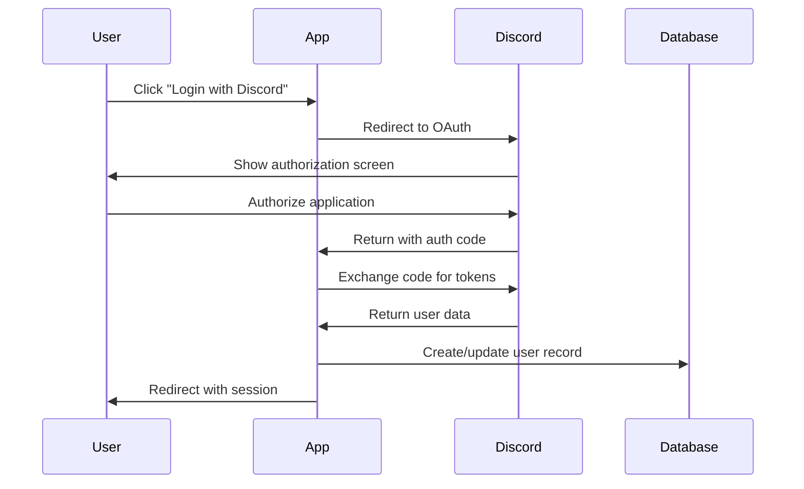

# Authentication Overview

## Authentication System

MTGRulingsBot uses NextAuth.js for authentication with Discord OAuth as the primary provider. The system is designed to be secure, scalable, and user-friendly.

## Authentication Flow



## Configuration

### NextAuth Configuration
Located in `app/(auth)/auth.config.ts`:

```typescript
export const authConfig = {
  pages: {
    signIn: '/login',
    error: '/login',
  },
  callbacks: {
    authorized({ auth, request: { nextUrl } }) {
      const isLoggedIn = !!auth?.user;
      const isOnChat = nextUrl.pathname.startsWith('/chat');
      const isOnLogin = nextUrl.pathname.startsWith('/login');
      
      if (isOnChat || nextUrl.pathname === '/') {
        if (isLoggedIn) return true;
        return false; // Redirect unauthenticated users to login page
      }
      
      if (isOnLogin && isLoggedIn) {
        return Response.redirect(new URL('/', nextUrl));
      }
      
      return true;
    },
  },
  providers: [], // Defined in auth.ts
};
```

### Discord Provider Setup
In `app/(auth)/auth.ts`:

```typescript
import Discord from 'next-auth/providers/discord';

export const { handlers, signIn, signOut, auth } = NextAuth({
  ...authConfig,
  providers: [
    Discord({
      clientId: process.env.DISCORD_CLIENT_ID,
      clientSecret: process.env.DISCORD_CLIENT_SECRET,
    }),
  ],
  callbacks: {
    async session({ session, token }) {
      if (token.sub && session.user) {
        session.user.id = token.sub;
      }
      return session;
    },
    async jwt({ token, user }) {
      if (user) {
        token.sub = user.id;
      }
      return token;
    },
  },
});
```

## Environment Variables

Required environment variables for authentication:

```bash
# NextAuth
AUTH_SECRET=your-secret-key-here
NEXTAUTH_URL=http://localhost:3000  # Production URL in production

# Discord OAuth
DISCORD_CLIENT_ID=your-discord-client-id
DISCORD_CLIENT_SECRET=your-discord-client-secret
```

## Discord Application Setup

### 1. Create Discord Application
1. Go to [Discord Developer Portal](https://discord.com/developers/applications)
2. Click "New Application"
3. Name your application (e.g., "MTGRulingsBot")
4. Save the application

### 2. Configure OAuth2
1. Go to "OAuth2" in the sidebar
2. Add redirect URIs:
   - Development: `http://localhost:3000/api/auth/callback/discord`
   - Production: `https://yourdomain.com/api/auth/callback/discord`
3. Select scopes: `identify` (required)
4. Copy Client ID and Client Secret

### 3. Bot Configuration (Optional)
If you plan to add Discord bot features:
1. Go to "Bot" in the sidebar
2. Create a bot user
3. Configure bot permissions
4. Copy bot token (separate from OAuth)

## Session Management

### Session Storage
- Sessions are stored using NextAuth's built-in JWT strategy
- Session data includes user ID, name, email, and image
- Sessions persist across browser sessions

### Session Validation
```typescript
import { auth } from '@/app/(auth)/auth';

// In API routes
export async function GET(request: Request) {
  const session = await auth();
  
  if (!session?.user?.id) {
    return new Response('Unauthorized', { status: 401 });
  }
  
  // Proceed with authenticated logic
}

// In Server Components
export default async function Page() {
  const session = await auth();
  
  if (!session) {
    redirect('/login');
  }
  
  return <div>Welcome {session.user?.name}</div>;
}
```

### Session Types
```typescript
// Extend default session type
declare module 'next-auth' {
  interface Session {
    user: {
      id: string;
      name?: string | null;
      email?: string | null;
      image?: string | null;
    };
  }
}
```

## Authorization Patterns

### Route Protection
The middleware protects routes automatically:

```typescript
// middleware.ts
export const config = {
  matcher: [
    '/',
    '/chat/:path*',
    '/api/chat/:path*',
    // ... other protected routes
  ],
};
```

### API Route Authorization
```typescript
// Example API route protection
export async function POST(request: Request) {
  const session = await auth();
  
  if (!session?.user?.id) {
    return new Response('Unauthorized', { status: 401 });
  }
  
  // Additional authorization checks
  const { chatId } = await request.json();
  const chat = await getChatById(chatId);
  
  if (chat.userId !== session.user.id) {
    return new Response('Forbidden', { status: 403 });
  }
  
  // Proceed with authorized operation
}
```

### Component-Level Protection
```typescript
// Check auth in client components
'use client';

import { useSession } from 'next-auth/react';
import { redirect } from 'next/navigation';

export function ProtectedComponent() {
  const { data: session, status } = useSession();
  
  if (status === 'loading') return <div>Loading...</div>;
  if (status === 'unauthenticated') redirect('/login');
  
  return <div>Protected content</div>;
}
```

## Error Handling

### Common Auth Errors
1. **Invalid credentials**: Redirect to login with error message
2. **Expired session**: Automatic redirect to login
3. **Missing permissions**: Show appropriate error page
4. **Discord API errors**: Graceful fallback with retry option

### Error Pages
- `/login?error=configuration` - Missing environment variables
- `/login?error=access_denied` - User denied Discord authorization
- `/login?error=callback` - General callback error

## Security Considerations

### Session Security
- JWT tokens are signed with `AUTH_SECRET`
- Sessions expire automatically (default 30 days)
- Secure cookies in production (HTTPS only)

### CSRF Protection
- NextAuth provides built-in CSRF protection
- State parameter validation during OAuth flow
- Secure token handling

### Rate Limiting
Consider implementing rate limiting for:
- Login attempts
- Session creation
- API calls from authenticated users

## Troubleshooting

### Common Issues
1. **"Configuration" error**: Missing environment variables
2. **Redirect URI mismatch**: Discord app settings don't match
3. **Session not persisting**: Check `AUTH_SECRET` and domain settings
4. **Middleware redirect loops**: Check matcher configuration

### Debug Mode
Enable debug logging in development:

```bash
# In .env.local
NEXTAUTH_DEBUG=1
```

This will log detailed authentication flow information to the console.
